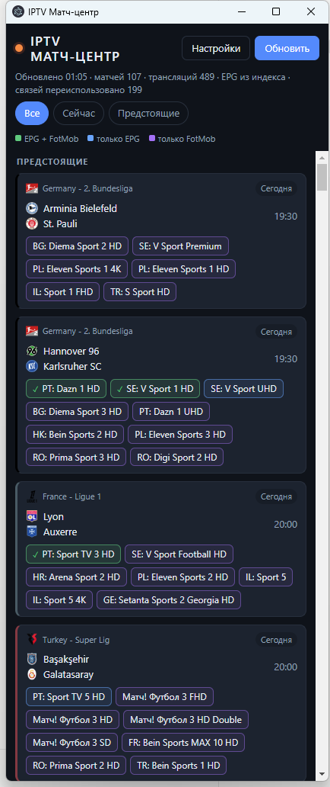

# IPTV Матч-центр

Спортивная телепрограмма поверх собственного IPTV-плейлиста: показывает
ближайшие и идущие футбольные матчи и **на каких ваших каналах их можно
посмотреть**. Клик по каналу открывает поток в VLC.



Окно прижимается к левому краю экрана, VLC открывается рядом справа — так
видно и ленту матчей, и картинку одновременно.

## Установка

1. Скачайте установщик со страницы
   [Releases](https://github.com/eonyushkin-commits/iptv-match-center/releases)
   (`IPTV-Match-center-Setup-*.exe`) или portable-версию.
2. Установите [VLC](https://www.videolan.org/vlc/) — приложение проигрывает
   потоки им, своего плеера в нём нет.

Windows, 64-разрядная. Обновления приходят сами: когда выйдет новая версия,
в окне появится строка с кнопкой «Перезапустить».

## Настройка

Всё в одном диалоге — кнопка **«Настройки»**:

| поле | что это |
|---|---|
| Плейлист | файл `.m3u`/`.m3u8` или прямая ссылка на него |
| EPG | ссылка на XMLTV-фид. Необязательно: по умолчанию берётся `url-tvg` из самого плейлиста |
| Путь к VLC | необязательно, обычно находится сам в `Program Files` |
| Турниры | какие чемпионаты отслеживать |

Плейлист проверяется на читаемость до сохранения, так что неверная ссылка не
затрёт рабочую.

## Что означают цвета кнопок

Каналы находятся двумя независимыми способами, и цвет показывает, насколько
результату можно верить.

| цвет | что за ним стоит |
|---|---|
| 🟢 зелёный | телепрограмма канала и данные FotMob **сошлись** — единственное, что здесь можно назвать проверенным |
| 🔵 синий | только телепрограмма канала |
| 🟣 сиреневый | только права на показ по версии FotMob; телепрограмма это не подтверждает |

Наведите курсор на кнопку — во всплывающей подсказке видно, какая именно
передача стоит в программе канала и в какое время.

Сиреневый не значит «неверно»: чаще всего это каналы вроде Sky Sports, где в
заголовках передач названий команд нет физически («Saturday Night Football»),
и подтвердить их просто нечем.

## Как это устроено

Расписание, счёт и минута берутся с открытого API [FotMob](https://www.fotmob.com/)
— без ключа и регистрации. Каналы находятся сопоставлением уже известного
матча с телепрограммой вашего плейлиста: ищется передача рядом со стартовым
свистком, в заголовке которой названы **обе** команды. Вторым источником идут
данные FotMob «где смотреть», привязанные к стране канала.

Чтобы приложение оставалось быстрым, тяжёлая работа не повторяется впустую:
телепрограмма (а это бывает 200+ МБ) разбирается один раз на скачанный фид, а
матчи пересопоставляются, только если что-то действительно изменилось.
Обычное обновление занимает пару секунд и не подвешивает окно.

## Ограничения, о которых честнее сказать сразу

- **Матч без единого найденного канала в ленту не попадает.** Показывается
  только то, что можно включить.
- **Названия команд сопоставляются с заголовками телепрограммы нестрого** —
  иначе «Барселона» никогда не нашла бы `Barcelona`. Если какой-то клуб не
  опознаётся, его написание можно добавить в `teams.json` рядом с данными
  приложения, не дожидаясь новой версии. Приложение само складывает
  предложения в `teams-candidates.json`.
- **Телепрограмма провайдера бывает неверна.** Проверено живьём: фид уверенно
  называл матч на каналах, где на самом деле шли ралли и другая игра. Поэтому
  приложение и показывает происхождение связи вместо того, чтобы делать вид,
  что знает правду.

## Разработка

```
npm install
npm start     # запуск
npm test      # 150 тестов, без сети и без диска, ~1 с
npm run dist  # сборка установщика и portable под Windows
```

Зависимостей две: `electron-updater` и `koffi` (нужен, чтобы поставить окно
VLC рядом с окном приложения). Базы данных нет — всё лежит JSON-файлами.

Внутреннее устройство, принятые решения и грабли, на которые уже наступали, —
в [CLAUDE.md](CLAUDE.md). История разборов версий 1.x — в
[DECISIONS.md](DECISIONS.md).

## Лицензия

MIT.
